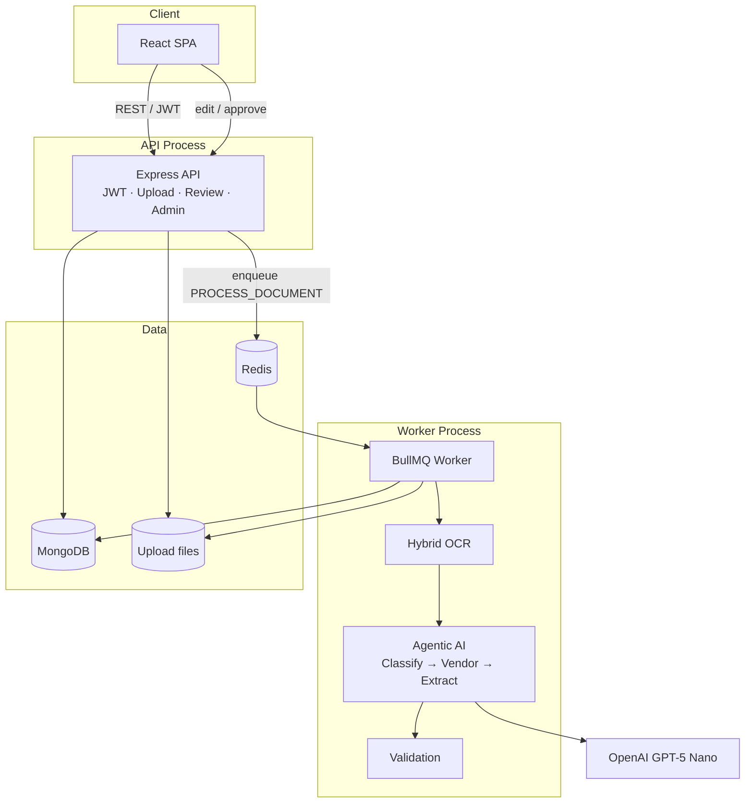
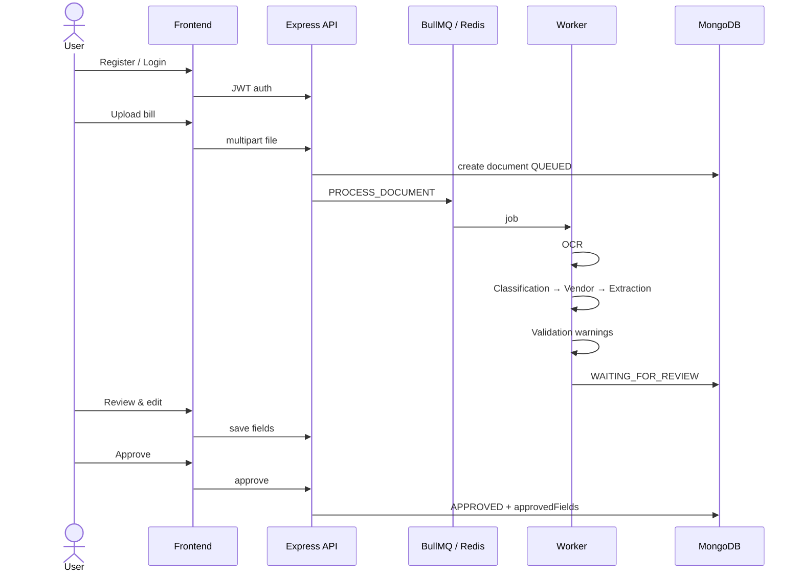
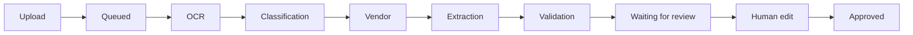
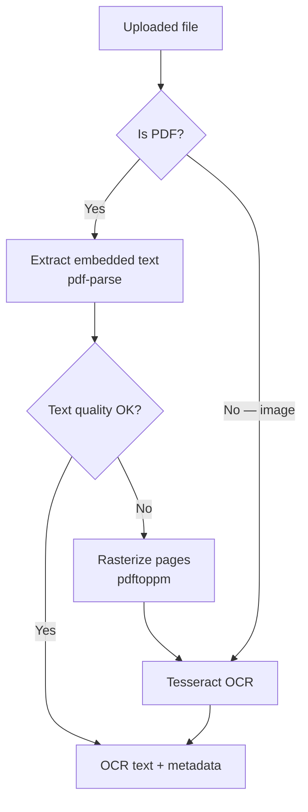
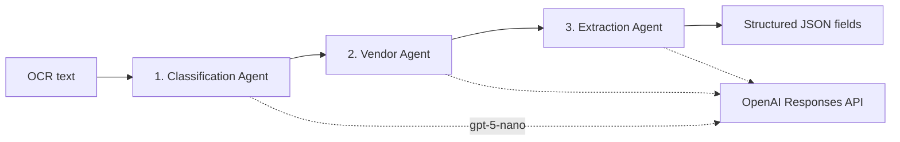
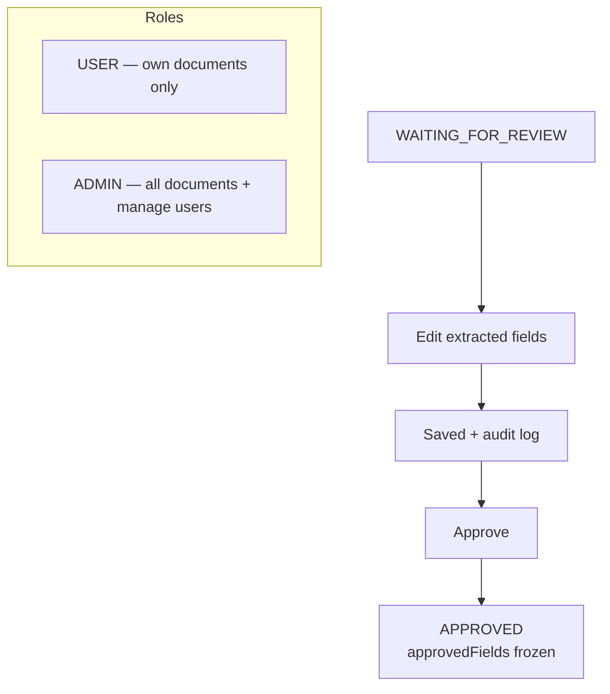
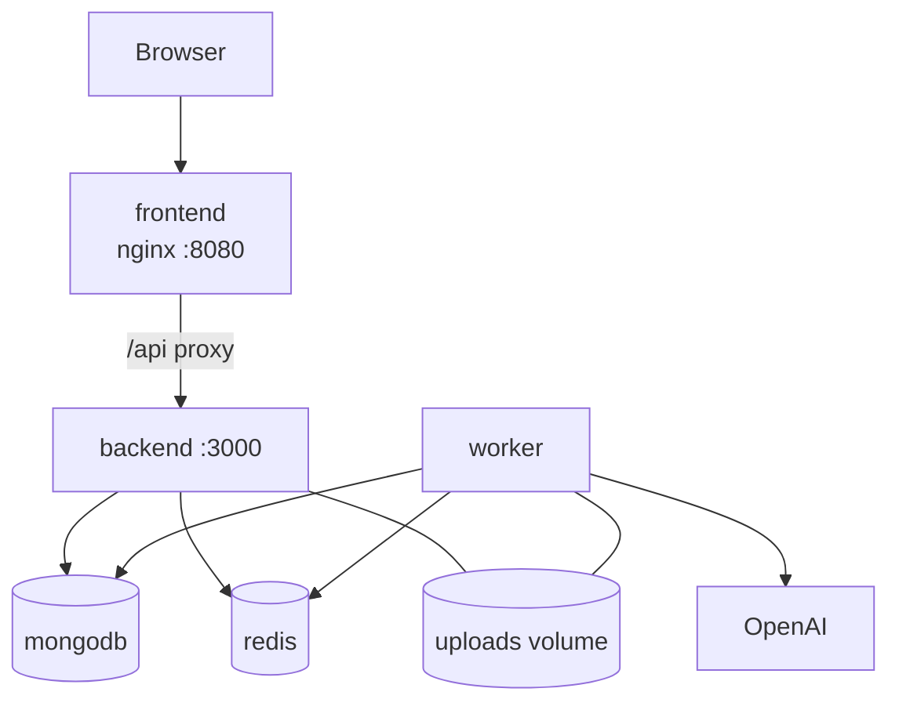

# Architecture

ZeroCarbon.one utility bill extraction — as implemented.

---

## 1. System overview



**Idea:** the API accepts uploads and reviews; a separate worker does the heavy OCR + AI work so the UI stays responsive.

---

## 2. End-to-end pipeline





---

## 3. Hybrid OCR



Quality uses length + alphanumeric ratio. Multi-page PDFs are merged. Temp raster files are cleaned up after OCR.

---

## 4. Agentic AI (OpenAI)



Behind an `AiProvider` interface (Option B — cloud). Prompts live in separate files. Output is structured JSON for validation and review.

---

## 5. Human review & RBAC



**First registered user → ADMIN.** Later users → USER. Admins can promote others.

---

## 6. Docker Compose layout



```bash
cp backend/.env.example backend/.env   # set JWT_SECRET + OPENAI_API_KEY
docker compose up --build
```

Compose sets Mongo/Redis service hostnames. API and worker share the same image and upload volume.

---

## 7. Backend modules

| Module | Responsibility |
|---|---|
| `authentication` / `users` | JWT, register/login, RBAC |
| `upload` | Multipart validation, store file, enqueue |
| `queue` | BullMQ producer + worker consumer |
| `ocr` | Hybrid PDF / image OCR |
| `ai` | Classify → vendor → extract |
| `validation` | Warnings (missing, units, duplicate, suspicious) |
| `review` | Edit fields + approve |
| `documents` | Persistence + lists |
| `health` | Mongo / Redis / queue status |

---

## Why this shape

- Matches assignment: Upload → Queue → OCR → AI → Validation → Human review  
- API and worker scale independently  
- Human approval is required (no auto-approve)  
- Secrets live only in `backend/.env` (never committed)  
